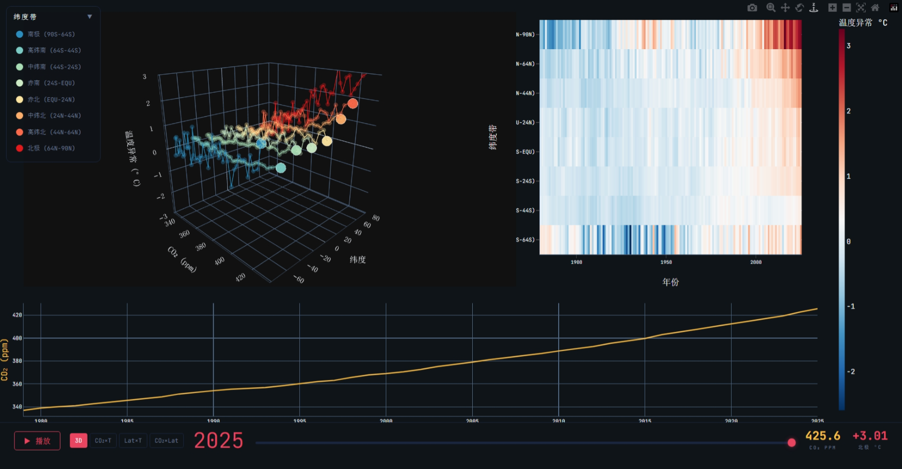

## 全球气候演变 3D 交互可视化：CO₂ 浓度、纬度与温度异常的关系探究（1880–2025）

###### 公开访问 URL
https://stu-vad.github.io/Final-Assignment/

###### 小组成员与贡献

| 姓名 | 学号 | 贡献 |
|------|------|------|
| [TODO] | [TODO] | [TODO] |
| [TODO] | [TODO] | [TODO] |

---

### 1. 动机与目标

"全球变暖"这一结论已被广泛认知，但其中几个关键事实在传统二维图表中难以充分表达：

1. **极地放大效应**：北极升温速度是赤道地区的 3–4 倍，需要同时展示纬度和温度维度
2. **CO₂-温度耦合的纬度差异**：不同纬度带对 CO₂ 的响应强度不同，需多维度对比
3. **时间演化特征**：升温转折点和极端异常年需要动态对比才能识别

这些结论涉及 CO₂、纬度、温度三个维度的耦合关系，二维折线图或热力图只能展示其中两个维度的关系，无法呈现完整的三维结构。因此本项目的目标是构建三维交互可视化，将三个变量映射到空间位置，辅以时间动画，让用户通过旋转视角和切换年份自主探索这些模式。具体围绕三个问题展开：

- **Q1**：不同纬度带的升温速度差异有多大？
- **Q2**：CO₂ 与各纬度带温度变化有怎样的相关结构？
- **Q3**：极端异常年份在空间上有何特征？

目标用户包括三类：

- **气候科学/可视化课程学生**：需要将抽象概念落地为可探索的数据
- **对气候变化感兴趣的公众**：希望通过交互式证据自主验证结论
- **科普教师**：需要直观的演示工具

界面以中文为主，交互设计力求直觉化，无需专业背景即可使用。

---

### 2. 数据

数据来自两个公开数据集：CO₂ 年均浓度来自 NOAA GML（1979–2025，47 条记录），温度异常来自 NASA GISTEMP v4（1880–2025，146 条记录，按 8 个纬度带分别记录，基准期 1951–1980）。

按 Munzner 框架抽象，核心属性的类型如下：年份为 quantitative（interval），CO₂ 浓度为 quantitative（ratio），温度异常为 quantitative（diverging——有正有负），纬度带为 categorical（ordered——从南极到北极有天然空间顺序）。其中温度异常的 diverging 类型直接决定了后续选择发散色板而非彩虹色板。

两个数据集以 year 为主键做左连接，CO₂ 在 1979 年前为空值，因此 3D 散点仅覆盖 1979–2025（47 年 × 8 带 = 376 个数据点）。温度的 8 个纬度列 melt 为长表格式（146 年 × 8 带 = 1168 行），供热力图展示全局模式；每行代表某年某纬度带的一次温度观测记录。

---

### 3. 分析任务

在确定可视化方案之前，先明确需要支持用户完成哪些分析任务。按 Munzner 框架的 Why 层定义了 6 个任务：

- **T1 Discover**：探索 CO₂-温度-纬度的三维分布与演变趋势
- **T2 Compare**：比较不同纬度带的升温模式与响应差异
- **T3 Identify**：识别极端温度异常年份和异常纬度带
- **T4 Browse**：浏览任意年份的温度空间分布模式
- **T5 Locate**：定位升温超过阈值的时间点
- **T6 Summarize**：观察十年际温度变化趋势

其中 T1–T3 为核心任务，直接对应三个研究问题；T4 支持探索式假设生成；T5–T6 支持结论验证。T2 通过趋势线的静态斜率对比和图例过滤功能直接支持——用户可在 3D 散点中比较各纬度带趋势线的陡缓差异，并通过图例隐藏无关带以聚焦对比，同时热力图提供全局色块模式的辅助参照。

---

### 4. 视觉编码与交互

#### 4.1 标记与通道

编码面临的核心问题是四个属性（CO₂、纬度、温度、年份）要同时展示，但有效通道有限。按 Munzner 的通道有效性排序，空间位置 > 颜色 > 尺寸 > 形状。因此 CO₂、纬度、温度三个定量变量被分配到 X/Y/Z 空间位置，纬度带额外冗余编码到颜色通道——3D 视角旋转时 Y 轴位置会产生透视变形，分类颜色提供了不受投影影响的识别手段。年份通过动画帧序列与趋势线共同表达，而非强行映射到空间维度。

| 视觉 idiom | Mark | 数据属性→通道映射 | 分析任务 |
|------------|------|-----------------|---------|
| 3D 散点图 | Point | CO₂→X, 纬度→Y, 温度→Z, 纬度带→颜色(冗余) | T1 发现分布 |
| 趋势线 | Line | 按 CO₂-纬度-温度坐标连线，颜色编码纬度带 | T1 发现趋势, T2 对比差异 |
| 温度热力图 | Area | 年份→X, 纬度→Y, 温度→颜色 | T3 识别异常, T4 浏览 |
| CO₂ 时序图 | Line | 年份→X, CO₂→Y, 不确定度→阴影带 | T5 定位阈值 |

#### 4.2 3D 气候仪表板

主可视化采用 item-set 多视图布局，热力图与 CO₂ 时序线作为静态上下文视图，3D 散点图作为核心交互视图通过年份滑块控制时间帧。核心是 3D 散点图——每个 point 代表某年某纬度带的一次观测，8 个纬度带各以独立颜色绘制（与 Y 轴位置冗余编码），附带白色描边以增强暗色背景下的可辨识度。趋势线连接每个纬度带截至当前年份的历史数据点，将时间演化轨迹静态可视化——用户无需播放动画即可比较各带的升温斜率差异：北极带趋势线斜率明显陡于赤道带，极地放大效应一目了然。47 帧逐年推进时，当前帧为高亮 point 及趋势线，历史层以半透明 point 展示截至当前年份的全部历史数据作为参照。

左上角的可折叠图例面板列出全部 8 个纬度带及其对应颜色。点击任意条目可切换该带的显示/隐藏状态——同时控制该带的当前散点、历史轨迹和趋势线三条 trace，使用户能聚焦于感兴趣的纬度带进行对比分析（直接支持 T2 Compare）。

热力图作为 overview 视图提供 146 年全局模式，3D 散点作为 detail 视图呈现具体年份的三维结构，二者互补，遵循 Shneiderman 的 overview-first 原则。底部 CO₂ 时序线提供时间维度上的上下文。热力图与 CO₂ 时序线为静态视图，展示完整历史数据，不随年份滑块变化；仅 3D 散点图响应滑块交互，逐年更新高亮点、历史轨迹和趋势线。

#### 4.3 交互设计

| 交互类型 | Munzner 分类 | 解决什么问题 |
|---------|-------------|------------|
| 年份滑块 | Navigate (sequence) | 控制 3D 散点图的时间帧 |
| 播放/暂停 | Navigate (sequence) | 自动演变动画，支持 T1 |
| 3D 旋转/缩放 | Navigate (viewpoint) | 解决 3D 遮挡，切换视角 |
| 悬停提示 | Select (hover) | 精确读取 item 属性值 |
| 预设视角切换 | Navigate (viewpoint) | 快速切换正交投影视角（CO₂×T, Lat×T, CO₂×Lat），消除遮挡 |
| 图例点击切换 | Filter (item) | 按纬度带过滤显示/隐藏，聚焦特定区域对比 |
| 双击重置视角 | Navigate (viewpoint) | 在预设视角模式下双击回到三维全景 |

设计逻辑：Navigate 类交互（滑块、播放、旋转、预设视角）服务探索式浏览（T1/T4），Select 类（悬停）服务精确识别（T3），Filter 类（图例切换）服务纬度带间的聚焦对比（T2）。预设视角功能通过正交投影将三维结构分别投影到三个二维平面，降低 3D 交互门槛。

---

### 5. 设计理念

可视化设计的核心问题是：四个关键属性（CO₂、纬度、温度、年份）需要同时呈现，而视觉通道的表达能力有限。本节从感知理论、设计原则和文献实证三个层面论证设计选择的合理性。

**空间位置优先编码核心变量**：Mackinlay (1986) 在 APT 系统中首次系统排序了视觉通道对定量数据的表达精度，Cleveland & McGill (1984) 通过大规模图形感知实验验证了该排序：空间位置 > 长度 > 角度/斜率 > 面积 > 体积/密度 > 颜色饱和度 > 颜色色相。本项目中 CO₂、纬度、温度三个核心定量变量被分配到 X/Y/Z 空间位置——这是人眼可分辨的最高精度通道。每个数据点的三维坐标直接编码其三重属性，用户无需通过图例或标注进行间接推断。年份作为第四个变量通过动画帧序列表达（详见下文动画讨论），而非强行挤入已经饱和的空间通道。

**纬度带的分类颜色编码**：3D 散点图将 8 个纬度带映射为 8 种独立颜色，与 Y 轴的空间位置形成冗余编码。Munzner (2014) 指出冗余编码在通道带宽允许时可增强读图效率。3D 旋转时 Y 轴位置会发生透视变形，导致不同纬度带的空间关系难以判断；分类颜色提供了不受投影影响的识别通道，用户旋转视角后仍能准确追踪各带的散点和趋势线。代价是放弃了将温度映射到散点颜色通道，但温度信息仍通过 Z 坐标、悬停提示和热力图三种途径精确传达。

**趋势线弥补动画局限**：Tversky et al. (2002) 指出动画在展示连续变化过程时直观，但不利于精确比较——用户难以同时追踪多个运动对象。趋势线直接将每个纬度带的历史轨迹绘制为连线，在静态状态下即可呈现升温斜率的纬度差异，与动画形成互补：动画展示演变过程，趋势线提供可精确比较的静态参照。北极带的趋势线斜率明显大于赤道带，极地放大效应无需播放即可识别。

**发散色板而非彩虹色**：Borland & Taylor (2007) 系统论证了彩虹色阶的三个缺陷：(1) 感知非线性——等距数据不产生等距感知差异；(2) 人为边界——色相急剧变化处易被误读为数据边界；(3) 对色觉障碍者不友好。热力图中的温度异常数据天然是 diverging 类型——正值为偏暖（红），负值为偏冷（蓝），零值为基准。本设计采用蓝-白-红自定义发散色阶（深蓝→白→深红），将零值映射为白色中点，正负方向各沿单一色相渐变，满足感知线性度要求，语义直观（红=热、蓝=冷），且对红绿色盲友好。3D 散点图采用分类颜色编码纬度带身份而非温度，温度信息通过 Z 坐标和悬停提示传达。

**动画与静态视图互补**：Tversky et al. (2002) 通过综述研究指出动画在展示连续变化过程时比静态序列更有效，但不利于精确数值比较——用户难以同时追踪多个运动对象的具体数值。基于这一发现，本设计采用多轨策略：3D 散点的逐年动画用于展示时间演化趋势（服务 T1 Discover 和 T4 Browse），趋势线将各带轨迹静态化以支持精确斜率对比（服务 T2 Compare），静态温度热力图覆盖 146 年全局提供精确对比基线（服务 T3 Identify 和 T6 Summarize），CO₂ 时序线提供量化的时间上下文（服务 T5 Locate）。用户在热力图中定位异常年份，再到 3D 视图中观察其空间结构——两视图互补而非重复。

**Overview-first 多视图布局**：Shneiderman (1996) 提出的 Visual Information Seeking Mantra 是可视化设计的经典指导原则："Overview first, zoom and filter, then details-on-demand"。本系统遵循这一原则——热力图提供 1880–2025 全时段 overview（8 行 × 146 列），3D 散点提供单年 detail（8 个高亮 point + 截至当前年份的历史数据作为背景参照 + 趋势线），CO₂ 时序提供趋势 context。三面板各自展示数据的不同切面：热力图和 CO₂ 时序线作为静态上下文始终可见，3D 散点图通过年份滑块支持交互式时间探索，用户可自主在热力图中定位感兴趣的年份，再通过滑块在 3D 视图中观察其空间结构。

**暗色主题**：选择暗色背景不仅是为了美学偏好：在暗色背景下，发散色板的蓝-白-红渐变对比度更高，温度异常的细微差异更容易区分；同时暗色主题减少了长时间数据探索时的眼部疲劳，与科学可视化领域的常见惯例一致。

**纬度的 Y 轴排序**：纬度带从南极 (−77) 到北极 (+77) 自下而上排列，利用了人对"上北下南"地图认知的固有心理模型（mental model）。这种排序使用户无需学习即可将 Y 轴位置与地理纬度建立对应，降低了认知门槛——这符合目标用户中非专业公众和科普教师的需求。

---

### 6. 分析发现

**极地放大效应确认**： 北极 (64N-90N) 温度异常从 1880 年代约 -1.1°C 飙升到 2020 年代约 +2.6°C，2025 年达 **+3.01°C**，全球平均仅升至 **+1.19°C**。升温幅度远超赤道地区，且仍在加速。

**CO₂ 敏感性存在显著纬度梯度**： 3D 散点图中各纬度带的趋势线直观呈现了升温斜率的差异——北极带趋势线陡峭上升，而赤道带趋势线近乎平缓。北极带数据点随 CO₂ 升高快速向 Z 轴正方向（高温区）移动，而赤道带数据点的垂直位移明显较小。热力图中北极带在 2000 年后几乎全部呈现深红色，赤道带则多为浅橙至白色。CO₂ 从 336.85 ppm 升至 425.65 ppm（+89 ppm），北极温度异常从约 −0.6°C 升至 +3.01°C，赤道带仅从约 +0.3°C 升至 +0.9°C 左右。这表明全球平均升温数字严重低估了极地地区的实际升温幅度。

**极端年份呈现空间衰减模式**： 热力图上，2016、2023、2024 等异常年呈现"红色脉冲"从极地向赤道衰减的清晰模式。2016 年北极达 **+3.26°C**（历史最高，强厄尔尼诺叠加），甚至超过 2025 年的 +3.01°C，反映了短期波动叠加在长期趋势上的特征。

**南北半球升温不对称**： 高纬北（44N-64N）2025 年异常 +1.99°C，对应高纬南（64S-44S）仅 +0.56°C。这种不对称可能与北半球更大的陆地面积有关——陆地比热容低于海洋，升温响应更快。

---

### 7. 用户研究

邀请 3 名用户使用可视化系统，要求他们完成两个探索任务：在 3D 散点图中找出北极最热年份、在热力图中对比两个年代温差。观察操作过程后进行简短访谈，收集反馈。

**优点**： 所有用户均能顺利完成两个任务。热力图被评为最直观的视图，无需学习即可理解色标含义。3D 散点图的播放动画获得一致好评，用户表示"能清晰看到北极点的运动轨迹"。

**不足**： 一名用户未理解发散色板零点含义，建议在色标旁标注基准期。

---

### 8. 局限性

1. CO₂ 数据无纬度分解，同年所有纬度带共享相同 X 坐标，降低了信息密度。可尝试引入格点化 CO₂ 数据（如 CarbonTracker）为各纬度带提供差异化的 X 值。
2. 3D 散点不可避免存在遮挡，虽已通过分类颜色编码、趋势线和预设正交投影视角缓解，但仍需用户主动切换视角。可进一步增加自动推荐最佳视角的功能。
3. 8 个纬度带空间分辨率有限，无法展示同一纬度带内的经度差异。可采用 GISTEMP 格点级数据，但需权衡浏览器渲染性能。
4. 发散色阶范围固定为 ±3.0°C，而 2016 年北极异常达 +3.26°C 超出色阶上限，极端值之间无法通过颜色区分。可扩展为 ±3.5°C 或采用动态范围。

---

### 9. 参考文献

1. Munzner, T. (2014). *Visualization Analysis and Design*. CRC Press.
2. Borland, D., & Taylor II, R. M. (2007). Rainbow Color Map (Still) Considered Harmful. *IEEE Computer Graphics and Applications*, 27(2), 14–17.
3. Heer, J., Bostock, M., & Ogievetsky, V. (2010). A Tour Through the Visualization Zoo. *Communications of the ACM*, 53(6), 59–67.
4. Mackinlay, J. (1986). Automating the Design of Graphical Presentations of Relational Information. *ACM Transactions on Graphics*, 5(2), 110–141.
5. Cleveland, W. S., & McGill, R. (1984). Graphical Perception: Theory, Experimentation, and Application to the Development of Graphical Methods. *Journal of the American Statistical Association*, 79(387), 531–554.
6. Shneiderman, B. (1996). The Eyes Have It: A Task by Data Type Taxonomy for Information Visualizations. *Proceedings of the 1996 IEEE Symposium on Visual Languages*, 336–343.
7. Tversky, B., Morrison, J. B., & Bétrancourt, M. (2002). Animation: Can It Facilitate? *International Journal of Human-Computer Studies*, 57(4), 247–262.
8. NOAA Global Monitoring Laboratory. (2025). *Globally averaged marine surface annual mean CO₂ data*. https://gml.noaa.gov/ccgg/trends/gl_data.html
9. NASA Goddard Institute for Space Studies. (2025). *GISS Surface Temperature Analysis (GISTEMP v4)*. https://data.giss.nasa.gov/gistemp/
